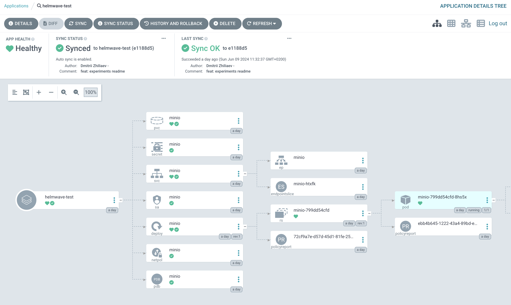

# argocd plugin for helmwave



1. Patch your argocd.

   We have prepared `argocd-values.yml` for [official argocd helm chart](https://github.com/argoproj/argo-helm/tree/main/charts/argo-cd)

```
helm repo add argo https://argoproj.github.io/argo-helm
helm install argo-cd argo/argo-cd -f argocd-values.yml
```

Follow documentation https://argo-cd.readthedocs.io/en/stable/operator-manual/config-management-plugins/

2. Create a repo with `helmwave.yml`

  See here: [examples/minio/helmwave.yml](./examples/minio/helmwave.yml)
  
4. Create argo-cd application

  See here: [examples/minio/argocd-application.yml](./examples/minio/argocd-application.yml)

  
